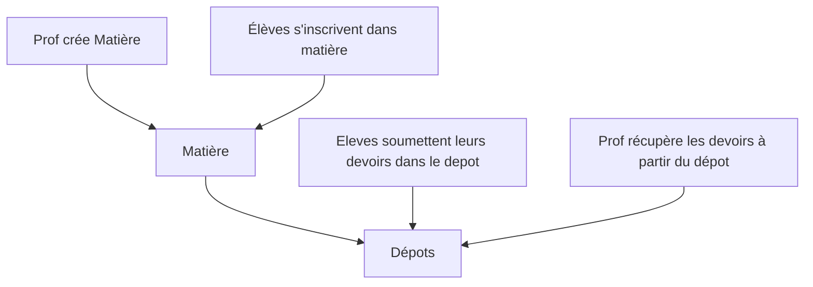

# AssignmentApp - Frontend

## Application de gestion de devoirs entre professeurs et élèves

Ce projet est une interface web développée avec [Angular CLI](https://github.com/angular/angular-cli) version 19.1.5 permettant la gestion de devoirs scolaires. Il est couplé avec un [backend Node.js / MongoDB](https://github.com/Alihou-junior/angular_back).

L'application offre une plateforme intuitive pour :
- Les enseignants : gestion des matières, création et évaluation des devoirs
- Les élèves : soumission des devoirs, consultation des notes
- Tous les utilisateurs : gestion de profil personnalisé

<br>

## Fonctionnalités principales

### 🎓 Pour les professeurs (rôle admin)
- **Gestion complète des matières** : création, modification, suppression
- **Gestion des devoirs** :
  - Consultation par matière
  - Attribution de notes et remarques
  - Modification/suppression des devoirs
- **Tableau de bord complet** avec filtres avancés

### 📚 Pour les élèves (rôle user)
- **Création de devoirs** avec sélection de matière
- **Visualisation des devoirs rendus/non rendus**
- **Consultation des notes et feedbacks**

### 👤 Pour tous
- **Système d'authentification** sécurisé
- **Recherche et filtres** avancés :
  - Par nom de devoir
  - Par matière
  - Par statut (rendu/non rendu)
- **Gestion de profil** :
  - Modification des informations personnelles
  - Changement de mot de passe
  - Upload de photo de profil

<br>

## Aperçu de l'application

<p align="center">
  
  
  
  
  
  
</p>

**Lien vers l'application déployée** : [AssignmentApp sur Render](https://assignment-app-final.onrender.com)

<br>

## 🧪 Données de test et démo

La base de données contient des données réalistes pour tester l'application :
- **+250 utilisateurs** (professeurs et élèves)
- **+30 matières** différentes
- **+3000 devoirs** avec notes et remarques

### Comptes pré-créés pour tester :

**👩🏫 Compte Professeur (admin) :**
- Email : `anna@gmail.com`
- Mot de passe : `password`
- Permissions : Gestion complète des matières et devoirs

**👨🎓 Compte Étudiant (user) :**
- Email : `r@gmail.com`
- Mot de passe : `password`
- Permissions : Soumission et consultation des devoirs

> ℹ️ Ces comptes utilisent des données simulées mais représentatives. Pour des raisons de sécurité, évitez d'utiliser des mots de passe sensibles avec ces comptes de démo.

### 🔐 Sécurité des comptes
- Tous les mots de passe sont chiffrés en base de données

<br>

## Architecture technique

### Frontend
- **Framework** : Angular 19
- **UI Components** : Angular Material
- **State Management** : RxJS (programmation réactive)
- **Routing** : Angular Router avec gardes d'authentification
- **Formulaires** : Reactive Forms avec validation avancée

### Fonctionnalités clés implémentées
- Pagination serveur avec filtres combinés
- upload d'images
- Design responsive (mobile/desktop)

<br>

## Installation locale

### Prérequis
- [Node.js](https://nodejs.org/) ≥ v17
- [Angular CLI](https://angular.dev/) ≥ v19
- Git

### Étapes d'installation

#### 1 - Installation de Node.js et Angular 
```bash
sudo apt install nodejs npm
node -v 
npm -v 
npm install -g @angular/cli
ng version
```

#### 2 - Cloner le depot du frontend 
```bash 
git clone https://github.com/votre_utilisateur/frontend-assignments.git
cd frontend-assignments
```

#### 3 - Installer les dependances
```bash 
npm install
```

#### 4 - Démarrer l'application
```bash 
ng serve
```
#### 5 - Acceder à l'application
Une fois le serveur demarré, Ouvrez votre navigateur à l'addresse ```http://localhost:4200 ``` L'application mettra à jour vos modifications en temps réel.

> **Note** : L'application utilise par défaut le backend déployé. Pour utiliser un backend local, suivez les instructions du dépôt backend [ici](https://github.com/Alihou-junior/angular_back) 


### Deploiement 
Pour deployer le projet en production, il faut :
-Compiler l'application 
```bash 
ng build --configuration production 
```
- le dossier ```dist/assignment-app/``` genéré peut etre servi par un serveur Node, Express ou un hebergeur statique
- Utilisez simplement la commande ```node server.js``` pour utiliser le server Express en dans votre terminal.


Apres lancement (sur Express par example), vous aurez acces à l'application localemnt à l'addresse ```http://localhost:4200/main/assignments```.

<br>

## Structure principale du code 

- `src/`
  - `app/`
    - `assignments/` - Gestion des devoirs
      - `add-assignment/` - Formulaire de création
      - `edit-assignment/` - Formulaire d'édition
      - `assignment-detail/` - Affichage détaillé
    - `matieres/` - Gestion des matières
      - `add-matiere/` - Ajout de matière
      - `edit-matiere/` - Édition de matière
    - `home/` - Autres Composants 
      - `edit-profile/` - Gestion du profil
      - `login/` - Page de connexion
      - `register/` - Page d'inscription
    - `shared/` - Services et utilitaires
      - `assignments.service.ts` - Service des devoirs
      - `auth.service.ts` - Service d'authentification
      - `matieres.service.ts` - Service des matières
      - ... 
  - ...

## Technologies utilisées 
- Angular - Framework web Frontend
- RxJS - Programmation reactive
- Angular Material - Composant UI

<br>

## Auteur(s) et Autrice(s) 
- [Alihou-junior](https://github.com/Alihou-junior) - Développeur principal 
- [capatainkomic](https://github.com/capatainkomic) - Développeuse collaboratrice

<br>

## 🚀 Roadmap & Améliorations Possibles

### 🔧 Refactorisations nécessaires

**Optimisations structurelles :**

- [ ] **Implémentation complète de la recherche de matières**  
  *(Barre de recherche existante dans `add-assignment.component.html` à connecter avec la logique dans le fichier TypeScript correspondant)*

- [ ] **Réorganisation des dossiers**  

- [ ] **Nettoyage des fonctions obsolètes**  
  *(Suppression du bouton "peupler" et de sa logique associée - Devenue inutil)*

- [ ] **Refactorisation complète du code**  
  *(Application des bonnes pratiques : typage strict, découpage des services, suppression des `any`)*

### ✨ Nouvelles Fonctionnalités

| Niveau       | Icône | Fonctionnalité       | Description |
|--------------|-------|----------------------|-------------|
| **Facile**   | 📁    | Gestion de fichiers  | •**Coté Elève** : Upload d'un fichier zip/pdf obligatoire lors de la création d'un devoir par un élève avec prévisualisation <br>• **Coté Prof** : Prévisualisation et Telechargement du devoir lors de sa consultation  |
| **Moyen**    | 📊    | Dashboard            | **Statistiques temps-réel** :<br>• Moyennes par matière<br>• Meilleur/pire 5 notes de l'élève<br>• Meilleur/pire par matières<br>• Taux de notation - Avancement dans la correction totale des devoirs <br>• Autres ...<br><br> **Systeme d'encouragement** :<br>• Mini système d'encouragement accompagné d'image de notre mascotte : le paresseux |
| **Complexe** | 🗂️    | Système de dépôts - Workflow similaire à Moodle  | **Nouveau workflow** :<br>1. Création de dépôts thématiques pour chaque matière par le professeur<br>2. Inscription des élèves dans des matières pour accéder aux depots crés par les profs<br>3. Soumission des devoirs dans le depot |
| **Avancé**   | ✉️    | Messagerie           | **Communication avec** :<br>• Notifications push<br>• Pièces jointes<br>• Historique |

### 🗺 Exemple de Workflow(Dépôts)



### 📅 Priorisation

1. **V1.1 (Immédiat)** :
   - Gestion fichiers + Dashboard de base
   - Refactorisation structure

2. **V2.0 (Moyen terme)** :
   - Système de dépôts complet
   - Intégration Système d'encouragement

3. **V3.0+** :
   - Messagerie temps-réel


